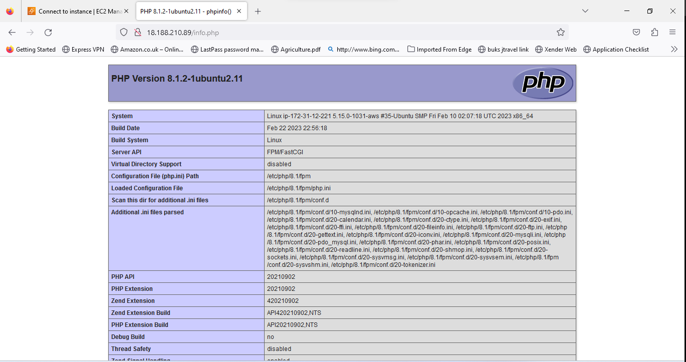

## Documentation of Projec 1

### Apache Installation

`sudo apt update`

`sudo apt install nginx`

`sudo systemctl status nginx`

`curl http://localhost:80`

`http://18.188.210.89:80`

### MySQL setup

`sudo apt install mysql-server`

`sudo mysql`

`ALTER USER 'root'@'localhost' IDENTIFIED WITH mysql_native_password BY 'PassWord.1';`

`mysql> exit`

`sudo mysql_secure_installation`

### PHP configurattion
`sudo apt install php-fpm php-mysql`

`sudo mkdir /var/www/projectLEMP`

`sudo chown -R $USER:$USER /var/www/projectLEMP`

`sudo nano /etc/nginx/sites-available/projectLEMP`

`sudo ln -s /etc/nginx/sites-available/projectLEMP /etc/nginx/sites-enabled/`

`sudo nginx -t`

`sudo unlink /etc/nginx/sites-enabled/default`

`sudo systemctl reload nginx`

`sudo echo 'Hello LEMP from hostname' $(curl -s http://169.254.169.254/latest/meta-data/public-hostname) 'with public IP' $(curl -s http://169.254.169.254/latest/meta-data/public-ipv4) > /var/www/projectLEMP/index.html`

`sudo rm /var/www/your_domain/info.php`

### TESTING PHP WITH NGINX

`sudo nano /var/www/projectLEMP/info.php`

`<?php`
`phpinfo();`

`http://18.188.210.89/info.php`

### Retrieving data from MySQL database with PHP

`sudo mysql`

`mysql> CREATE DATABASE ``example_database``;`

`mysql>  CREATE USER 'example_user'@'%' IDENTIFIED WITH mysql_native_password BY 'password';`

`mysql> GRANT ALL ON example_database.* TO 'example_user'@'%';`

`mysql> exit`

`mysql> SHOW DATABASES;`

`mysql> INSERT INTO example_database.todo_list (content) VALUES ("My first important item");`

`mysql>  SELECT * FROM example_database.todo_list;`

`mysql> exit`

`nano /var/www/projectLEMP/todo_list.php`

`http://18.188.210.89/todo_list.php`

